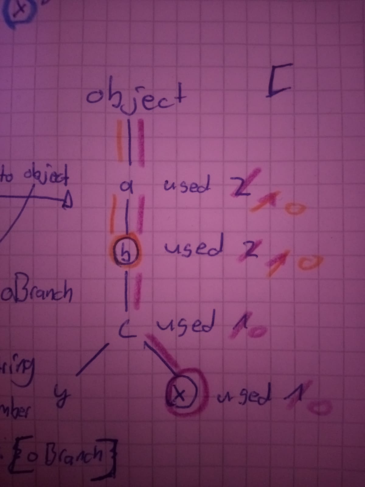

# [WIP] ProxyTree

> Create Proxy Tree based on the accessed properties

 <br />

<a href="https://github.com/agile-ts/agile">
  </a>
<a href="https://npm.im/@agile-ts/proxytree">
  </a>
<a href="https://npm.im/@agile-ts/proxytree">
  </a>
<a href="https://npm.im/@agile-ts/proxytree">
  </a>

<br />

## ❓ What is it for?

The Proxy Tree is an internal library of [AgileTs](https://agile-ts.org).
It is used to wrap a proxy around the target object, and its nested objects as you access them
in order to keep track of which properties were accessed via get/has proxy handlers.
This makes it possible to restrict the path to accessed properties.
With these paths, AgileTs can optimize the rerender count of a Component
by only rendering it when an (in the Component) accessed property mutates.

### ▶️ Use case in AgileTs
For example this functionality is used in the `useProxy()` hook.
```ts
// MyComponent.whatever
const myObject = useProxy(MY_OBJECT);

<p>{myObject.data.adressData.street}</p>;
```
The Component (represented in the above example) only rerenders if `myObject.data.adressData.street` changes
and no longer if anything in the object changes.
For instance, if we change `myObject.data.name` it won't rerender the Component,
since it wasn't used in it.

### 🌳 Construction of Proxy Tree

First, the `orginal` object is converted into the root Branch (`.rootBranch`).
Each Branch represents a particular object that is wrapped in a `Proxy()`
and keeps track of its child Branches.
These child Branches are created as soon as a certain property in the parent Branch has been accessed.
Then the accessed property will be transformed into a sub Branch of the parent Branch and gets part of the Proxy Tree.
This way, only accessed properties are added to the Proxy Tree.
The Proxy Tree isn't aware of the other (not accessed) properties, as they aren't yet relevant.
As soon as an unrecognized property is accessed, it is added to the Proxy Tree.
```ts
// Orginal Object with sub Objects
const original = {
  a: [{ b: 1 }, { 1000: { a: { b: 1 } } }, '3rd'],
  b: { c: { d: 'hi' } },
  c: { a: 'hi' },
};

// Create Proxy Tree
const proxyTree = new ProxyTree(original);
const proxyfiedOrginal = proxyTree.proxy;  

// Access Properties
proxyfiedOrginal.a;
proxyfiedOrginal.a[0];
proxyfiedOrginal.c.a;

// Proxy Tree would look like that:
Branch({
  a: Branch([Branch({ b: 1 }), { 1000: { a: { b: 1 } } }, '3rd']),
  b: { c: { d: 'hi' } },
  c: Branch({ a: Branch('hi') }),
});

// Access more Properties
proxyfiedOrginal.b;
proxyfiedOrginal.a[2];

// Proxy Tree would ow look like that:
Branch({
  a: Branch([Branch({ b: 1 }), { 1000: { a: { b: 1 } } }, Branch('3rd')]),
  b: Branch({ c: { d: 'hi' } }),
  c: Branch({ a: Branch('hi') }),
});
```

## ⚡️ API

### `getUsedRoutes()`

Returns the Path to the accessed properties in array shape.
```ts
// Orginal Object with sub Objects
const original = {
  a: [{ b: 1 }, { 1000: { a: { b: 1 } } }, '3rd'],
  b: { c: { d: 'hi' } },
  c: { a: 'hi' },
};

// Create Proxy Tree
const proxyTree = new ProxyTree(original);
const proxyfiedOrginal = proxyTree.proxy;

// Access Properties
proxyfiedOrginal.a;
proxyfiedOrginal.a[0]['b'];
proxyfiedOrginal.a[1][1000]['a']['b'];
proxyfiedOrginal.c.a;
proxyfiedOrginal.b;

// Get route to accessed Properties
console.log(proxyTree.getUsedRoutes()); // Returns (see below)
// [
//   ['a', '0', 'b'],
//   ['a', '1', '1000', 'a', 'b'],
//   ['c', 'a'],
//   ['b'],
//   ['a'],
// ]
```
The algorithm behind reconstructing the used routes/paths is pretty simple.
It may not be very efficient, but it works, and that is what counts for now.



In the above image, each blue-circled property was the end accessed property (so b and x).
Each time a property was accessed, 
the Proxy Tree counted the `used` property of this Route/Node. 
Also, between Routes like 'a' or 'c' were accessed and thus incremented.
This is due the fact that, by accessing the property `c` via `a.b.c`, you access `a` and `b` before accessing `c`.
This way, we are able to reconstruct the paths to the accessed properties 
with the simple algorithm you can see in the above image.


### `transformTreeToBranchObject()`

Transforms Proxy Tree into an easily processable object.
Therefore, it goes through each Branch (starting at the root Branch) and transforms them into a `BranchObjects`.
```ts
// Orginal Object with sub Objects
const original = {
  a: [{ b: 1 }, { 1000: { a: { b: 1 } } }, '3rd'],
  b: { c: { d: 'hi' } },
  c: { a: 'hi' },
};

// Create Proxy Tree
const proxyTree = new ProxyTree(original);
const proxyfiedOrginal = proxyTree.proxy;

// Access Properties
proxyfiedOrginal.a;
proxyfiedOrginal.a[0];
proxyfiedOrginal.c.a;

console.log(proxyTree.transformTreeToBranchObject()); // Returns (see below)
// {
//   key: 'root',
//   timesAccessed: 3,
//   branches: [
//     {
//       key: 'a',
//       timesAccessed: 2,
//       branches: [{ key: '0', timesAccessed: 1, branches: [] }],
//     },
//     {
//       key: 'c',
//       timesAccessed: 1,
//       branches: [{ key: 'a', timesAccessed: 1, branches: [] }],
//     },
//   ],
// }
```
